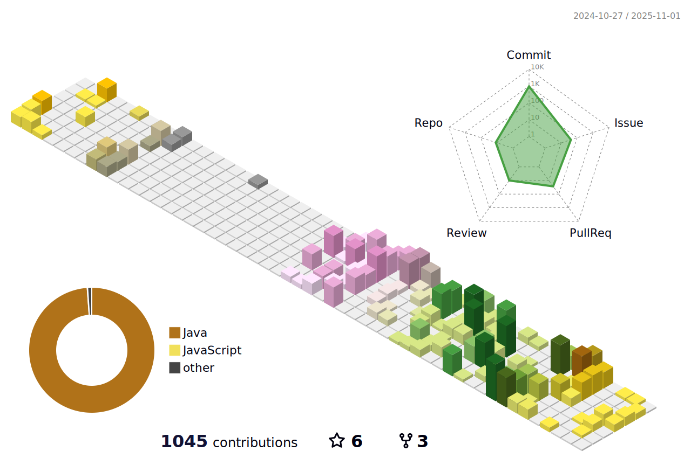

<!--
**KimKiHyun0206/KimKiHyun0206** is a ✨ _special_ ✨ repository because its `README.md` (this file) appears on your GitHub profile.

Here are some ideas to get you started:

- 🔭 I’m currently working on ...
- 🌱 I’m currently learning ...
- 👯 I’m looking to collaborate on ...
- 🤔 I’m looking for help with ...
- 💬 Ask me about ...
- 📫 How to reach me: ...
- 😄 Pronouns: ...
- ⚡ Fun fact: ...
-->

 

 
 

 
 

      
      

<h2 style="color: #DDE6ED">📚 Tech Stack 📚</h2>

      
      
      

<h2 style="color: #526D82"> 📝 Experienced 📝 </h2>

      
      

